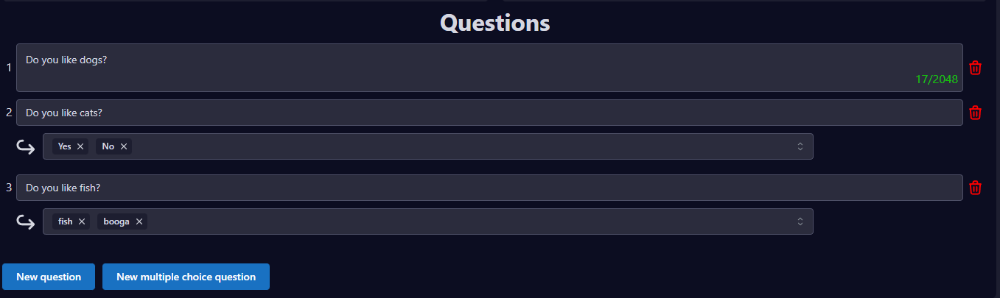

# 👍 Applications forms

You are seeking for new staff, it can be a new moderator, staff chief, supporter, a new member for your gaming clan or anything else you need to have control over who you let in. Appys applications is the right choice for this.

## What is applications forms?

The application forms give you control over who you approve for certain things on your server. This can be anything from staff jobs, to game members, various discord roles or anything else that just fits into your community.

Abby's application forms allow your members to easily apply for what you are looking for, while the applications will be displayed for you and your staff members in a clear way, with the possibility to accept or deny them.

<figure><figcaption>
An example of a application.
</figcaption></figure>


The submitted applications will be easy for you and your staff members to Accept or Deny.&#x20;


## The Application overview

<figure><figcaption></figcaption></figure>

In order to understand panels and how to create/edit applications, you must first understand the application overview.\
The Application overview is divided into 3 sections as seen above.

* <mark style="background-color:green;">**GREEN**</mark>** - The sidebar.** \
  This one will always be displayed no matter where you are on the dashboard. In the sidebar, you will be able to choose the many features that Appy offers. Hold your move over the feature in the sidebar to read about what its. In this case, select **Applications**.&#x20;
* <mark style="background-color:red;">**RED**</mark>** - Applications overview.** \
  This section is for creating new application forms, viewing your application forms and deleting application forms.
* <mark style="background-color:blue;">**BLUE**</mark>** - Applications options.** \
  In this section you can edit your application forms. There are various things that can be edited for application forms. It is also from here that you can create questions, tell the bot to give/remove roles and so much more.

## How to make a Application forms

Applications forms is easy and very user-friendly to set up. With only a few steps you have made your first application and your members is ready to apply at your server.&#x20;

### 1. Make a new Application

To create a new application, write the name of the application and then press "New Application"&#x20;

<figure><figcaption></figcaption></figure>

### 2. Fill out the applications data

<figure><figcaption></figcaption></figure>

When you want to create a Application, you must fill in some data so that Appy is aware of what you want it to do.

#### Normale features:

1. **Enable:** This one used to Enable/disable, its very usefull if you want to wait a week or so before your members can apply to this application. It can also be disable if you just want to close the application for some time, withour deleting it. &#x20;
2. **Application Name:** You can edit the applications name.
3. **Logging channel:** The logging channel is a channel where all the filled and submitted applications will go, and will be stored to be accepted/denied by you or your staff members.&#x20;
4. **Staff Threads:** If you want your logging channel to look clean and only contain the submitted applications. You can activate Staff Threads, so you and your staff members have a possibility to chat about the applications.&#x20;
5. **Completion message:** Use this if you want to send a personal messages to the user who have just completed an application.
6. **Accepted Message:** Use this if you want to send a personal messages to the user you just accepted.&#x20;
7. **Denied message:** Use this if you want to send a personal message to the user you just denied.
8. **Restricted roles:** Here you can select the roles on your server that are not allowed to use the application. \* _If you have selected several Restricted roles, please note that if they only have one of these roles, they cannot apply._
9. **Required roles:** Here you can select the roles that are required to be able to apply. \*_If you have selected several Required roles, the user mush have all of them to apply._&#x20;
10. **Accepted roles:** The roles an applicant will be given when their application is accepted.
11. **Denied roles:** The roles an applicant will be given when their application is denied.
12. **Ping roles:** The roles which are pinged when an application is made (useful for pinging staff!).
13. **Accepted removal roles:** The roles which will be removed when an applicant is accepted.
14. **Denied removal roles:** The roles which will be removed when an applicant is denied

#### Premium features:&#x20;

1. **Application manager roles:** If you have set your logging channel to be open for the other users then your staff members, but would like to decide for youself who can accept/deny the applications. If you have not set any roles in this, everyone on the server can process the applications.
2. **Application cooldown:** How often someone can re-apply to the application. Cooldown (In seconds)

### 3. Questions

<figure><figcaption></figcaption></figure>

You have made it through the data, not its time to make some quesions. \
There is two types of question you can make:&#x20;

* Ordinary questions
* Multiple choice questions

#### The ordinary questions

The ordinary questions are questions where the applicant must answer text-based. They have freedom to answer the question and have the option to write a few words or a whole novel.

<figure><figcaption></figcaption></figure>

#### The multiple choice questions

The multiple choice questions are questions where you choose the answer options. These questions are good for getting answers to specific things, where the applicant does not need to write anything, but instead has the opportunity to choose between options you have chosen.

<figure><figcaption></figcaption></figure>

### 4. Save

&#x20;Click  to save your progress, and the application will be saved. \
When the application is **Saved** and **Enabled** the users can now apply to the application.&#x20;

## You are done


Want to know how to apply to your application? Head to [How to apply](how-to-apply.md).&#x20;



**Support**\
If you need help with setting up applications please join our [**Support server**](https://discord.com/invite/bDmc55c6zY)**.** We'll be happy to help

