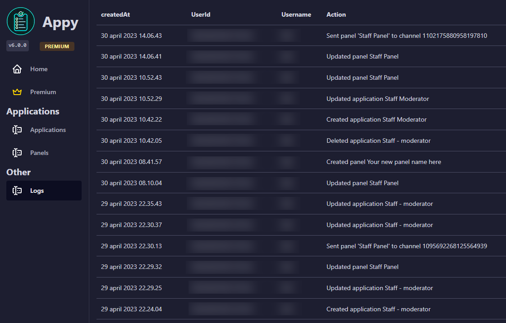

# 👍 Dashboard

The dashboard is the core of being able to create application forms.

In order to create good application forms, it is important that you understand and can navigate in Appy's dashboard. The next few pages will step-to-step guide you through the dashboard, so you will be able to use it while you sleep.

## Logging in

When you invite Appy bot to your server, a dashboard will automatically be created for that server. This makes it easier when you have to use it for the first time.

To log in to the dashboard, click the link below:&#x20;



1. Click on Login at the right top corner
2. Log in with your discord account

## Choose your server

When you are logged in, you will be able to see an overview of the servers you are owner of or have the permission to use bot, that use Appy.

<figure><figcaption></figcaption></figure>

Here you must choose which server you want to use Appy on and then click <mark style="color:yellow;">Configure.</mark>&#x20;


If you want to invite Appy to one of the servers, click the <mark style="color:yellow;">Invite</mark> button.&#x20;


## Server overview

<figure><figcaption></figcaption></figure>

As you can see above, the first page is divided into 3 sections.\
Its very easy to understand:

* <mark style="background-color:green;">**GREEN**</mark>** - The sidebar.** \
  This one will always be displayed no matter where you are on the dashboard. In the sidebar, you will be able to choose the many features that Appy offers. Hold your move over the feature in the sidebar to read about what its.&#x20;
* <mark style="background-color:red;">**RED**</mark>** - Server stats.**\
  &#x20;Here you will quickly get an overview of how many applications on a given server have been - accepted and denied. It also shows you whether you have any pending applications waiting to be processed.
* <mark style="background-color:blue;">**BLUE**</mark> **- Help section.**\
  The blue section will in the future contain guides, bot info and other things that could be helpful on the dashboard.


**Support**\
If you need help with Appy please join our [**Support server**](https://discord.com/invite/bDmc55c6zY)**.** We'll be happy to help.


## Logs

<figure><figcaption></figcaption></figure>

Logging is useful, especially if there are several of you helping each other to create applications, panels or other things on the dashboard.\
To find logging, go to the left sidebar and tap "_**Logs**_". \
This will show you a page that describes:

* CreatedAt: When the thing was changed/created/deleted.&#x20;
* UserID: The users ID, who have made som changes on the dashboard.&#x20;
* Username: The name of the user who made the changes.
* Action: What is changed.&#x20;

