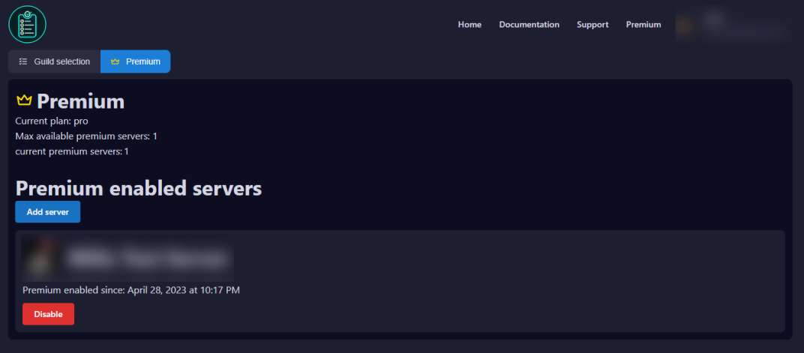

# Premium

## Take your applications to the next level!

Thank you for your interest in **Appy premium**! Your donation is very much appreciated and is vital for keeping the bot up and running. This premium subscription can be used in one server and will end at the end of the month (If you decide to cancel your subscription) **Premium perks.**

<table data-view="cards"><thead><tr><th align="center"></th><th align="center"></th><th data-hidden data-card-target data-type="content-ref"></th><th data-hidden data-card-cover data-type="files"></th></tr></thead><tbody><tr><td align="center">

The free plan of Appy, allows you to use all the <strong>free features.</strong>

You get access to:
<ul><li>Applications with cutom Accept or Deny options</li><li>App Panel - a unique way to allow users to apply for applications with ease</li><li>Appy Poll - with real-time updating results</li></ul>
</td><td align="center"></td><td></td><td></td></tr><tr><td align="center">

This tier allows you to enable Appy premium in <strong>1 servers.</strong>

You get access to:
<ul><li>Application history</li><li>Unlimited restricted roles</li><li>Unlimited accept roles</li><li>Unlimited deny roles</li><li>Unlimited ping roles</li><li>Customizable completion message</li></ul>
</td><td align="center"></td><td></td><td></td></tr><tr><td align="center">

This tier allows you to enable Appy premium in <strong>3 servers</strong>.

You get access to:
<ul><li>Includes everything from previous tier</li><li>Appy premium for <strong>3 of your servers</strong></li></ul>
</td><td align="center"></td><td></td><td></td></tr></tbody></table>

## Appy Plans 

<table><thead><tr><th width="256">Feature Description</th><th width="114">FREE</th><th width="111">TIER 1</th><th width="108">TIER 2</th></tr></thead><tbody><tr><td><mark style="color:blue;"><strong>Server Management</strong></mark></td><td></td><td></td><td></td></tr><tr><td>Appy Bot on servers</td><td>Unlimited</td><td>1</td><td>3</td></tr><tr><td>Fully functional dashboard</td><td></td><td></td><td></td></tr><tr><td>Customizable Commands</td><td></td><td></td><td></td></tr><tr><td>Support at Appys Support Server</td><td></td><td></td><td></td></tr><tr><td>Logging on dashboard</td><td></td><td></td><td></td></tr><tr><td><mark style="color:blue;"><strong>Applications Management</strong></mark></td><td></td><td></td><td></td></tr><tr><td>Applications </td><td></td><td></td><td></td></tr><tr><td>Custom Applications</td><td>Unlimited</td><td>Unlimited</td><td>Unlimited</td></tr><tr><td>Staff theads</td><td></td><td></td><td></td></tr><tr><td>Active applications at once</td><td>10</td><td>50</td><td>50</td></tr><tr><td>Application history</td><td></td><td></td><td></td></tr><tr><td>Unlimited restricted roles</td><td></td><td></td><td></td></tr><tr><td>Unlimited accept roles</td><td></td><td></td><td></td></tr><tr><td>Unlimited deny roles</td><td></td><td></td><td></td></tr><tr><td>Unlimited ping roles</td><td></td><td></td><td></td></tr><tr><td>Customizable completion message</td><td></td><td></td><td></td></tr><tr><td>Access to the application manager setting</td><td></td><td></td><td></td></tr><tr><td>Application manager roles</td><td></td><td></td><td></td></tr><tr><td><mark style="color:blue;"><strong>Panels</strong></mark></td><td></td><td></td><td></td></tr><tr><td>Panel Feature</td><td></td><td></td><td></td></tr><tr><td>Panel with drop down menu</td><td></td><td></td><td></td></tr><tr><td>Panel with buttons</td><td></td><td></td><td></td></tr><tr><td>Panel image</td><td></td><td></td><td></td></tr><tr><td>Panel footer</td><td></td><td></td><td></td></tr><tr><td>Panel color</td><td></td><td></td><td></td></tr><tr><td><mark style="color:blue;"><strong>Poll</strong></mark></td><td></td><td></td><td></td></tr><tr><td>Real-time updating Poll</td><td></td><td></td><td></td></tr><tr><td>Poll answer options</td><td>9</td><td>9</td><td>9</td></tr><tr><td></td><td></td><td></td><td></td></tr><tr><td><mark style="color:yellow;"><strong>GET</strong></mark></td><td>FREE</td><td>TIER 1 </td><td>TIER 2</td></tr></tbody></table>

## How to activate Premium?

You can activate your Premium in 3 easy steps.&#x20;

1. Go to the Appy [dashboard](https://appybot.xyz/dashboard?selected=premium)&#x20;
2. Click Premium, right next to Guild selection
3. Click "Add server" and choose the server you want to activate Premium on.&#x20;

<figure><figcaption></figcaption></figure>

## Frequently asked questions Premium

What is Appy Premium?

Take your applications to the next level with Appy premium! \
Appy premium offer some features that are not in the free version of Appy.&#x20;

These features will help with better management of your applications.\
They are particularly suitable for larger communities or communities that have many applications at the same time.

Link your Discord and Patreon

In order to know who has bought Premium, you will need to link your discord and patreon together.

Can I get a refund if I don't like it?

If, unexpectedly, you do not like Appy Premium after your purchase, you can get a refund within 24 hours of your purchase.

Can I transfer my premium subscription to another server?

If you want your Premium moved from one server to another server.&#x20;

1. Go to the Premium side on the dashboard.&#x20;
2. Click on Disable at the server you want to cancel it on
3. Click on Activate on the server you want to enable the Premium on.&#x20;

Your Premium will not be transfered to the new server. _This can take a few minutes._

Can someone else buy Premium for my server?

If you are a team on your server and you want Premium. \
It does not need to be you as the owner of the server who buys it, just as long as the person who buys Premium has the right permissions on the server.

Can I stop my subscription anytime?

You can cancel your subscription anytime and will end at the end of the month.&#x20;

What is the money used for?

Appy is a bot which requires powerful hardware and softwares. The money you pay for Appy Premium will help keep the bot up and running

