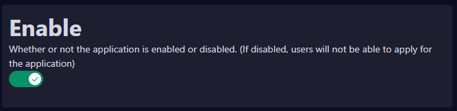

# 👍 Disabled application

<figure><figcaption></figcaption></figure>

## Application is disable?

If you are getting this messages, it means the application is **disable**. \
Either this is the intention on the part of the server staff or else it has been forgotten to be set to Enable.&#x20;

If you are unsure if it was a fail or the mening, ask the server staff.&#x20;

## How to fix on dashboard

1. Go to the disabled application
2. If there is a red X, then its disabled.&#x20;
3. Turn it on.&#x20;
4. Your application is now enabled and members can now apply to it.&#x20;

<figure><figcaption></figcaption></figure>


**Support**\
If you have questions about this, please join our [**Support server**](https://discord.com/invite/bDmc55c6zY)**.** We'll be happy to help.

