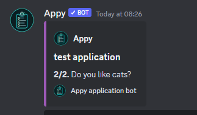

# Empty messages

If you send your panel to a channel and it shows a blank message or if you try to fill out an application and Appy only sends blank messages, you've come to the right place.

<figure><figcaption></figcaption></figure>

## How to fix?

There is a simple way to fix this:&#x20;

1. Go to your discord settings
2. Click on Text and Images
3. Activate Embeds and link prewiews so its green.&#x20;

<figure><figcaption></figcaption></figure>

Now your messages should look like this:


**Support**\
If Appy is still showing you empty messages, please join our [**Support server**](https://discord.com/invite/bDmc55c6zY).&#x20;

