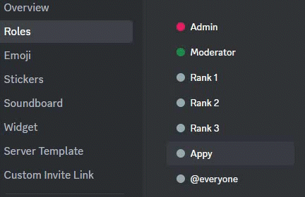

# 👍 Role problems

What do you do if you've set the Appy bot to give or remove roles when accepting and rejecting people who have submitted an application, and it doesn't? You can find the answer to this below!

## Role to low in Hierarchy

<figure><figcaption></figcaption></figure>

Appy cannot give/remove roles when the bots role is too low in the hierarchy.\
What to do then?&#x20;

1. Go to your **Discord** server settings&#x20;
2. Click on **Roles**.&#x20;
3. Find and click on **Appy's role**
4. Now move Appy's role **above** the roles you want the bot to give/remove.

<figure><figcaption></figcaption></figure>


Appy's role need to be higher then the roles you want it to give/remove.&#x20;


## Role permissions

Another thing that can cause Appy not to grant/remove roles is role premissions. \
You have to make sure Appy bot have the permission to manage roles.&#x20;

To make sure it have the premission:&#x20;

1. Go to your Discord server settings
2. Click on **Roles**.&#x20;
3. Find and click on **Appy's role**
4. Click on **Permissions**
5. Find **Manage Roles** and ensure its <mark style="color:green;">**ON**</mark>

<figure><figcaption></figcaption></figure>


**Support**\
If Appy is still showing you the error message, please join our [**Support server**](https://discord.com/invite/bDmc55c6zY)**.** We'll be happy to help.

